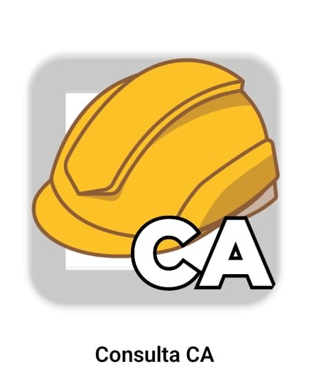
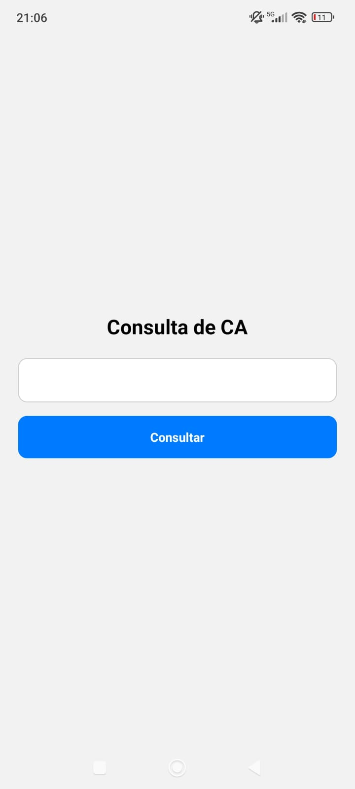

# 📱 Consulta CA

Aplicativo mobile desenvolvido para realizar a consulta de Certificados de Aprovação (CA) de Equipamentos de Proteção Individual (EPI) de forma rápida e prática.

O app consome uma API desenvolvida em Flask para buscar e retornar as informações oficiais do CA informado pelo usuário.

---

## Objetivo do Projeto

O objetivo do projeto é facilitar a verificação de validade e dados técnicos de EPIs, permitindo que técnicos e responsáveis realizem consultas diretamente pelo celular, sem necessidade de acessar sistemas complexos.

---

## Tecnologias Utilizadas

- React Native (Expo)
- EAS Build (Geração de APK)
- Flask (Backend em Python)
- Git e GitHub (Versionamento)

---

## Funcionalidades

✔ Consulta por número do CA  
✔ Integração com API em Flask  
✔ Retorno de dados detalhados do equipamento  
✔ Interface simples e objetiva  
✔ Geração de APK para instalação direta no Android  

---

# Demonstração do Aplicativo

## Tela Inicial

#### Icone do aplicativo desenvolvido:

Tela inicial/principal

---

## Objeto de teste

Foi utilizado um macacão para teste e posterior validação

Número CA do EPI

## Inserção do Número do CA

O macacão foi provado estar inapto para uso

Outros dados:

Um EPI dentro da validade

Um erro de inserção

---

## Backend (API Flask)

A aplicação se comunica com uma API desenvolvida em Flask responsável por:

- Receber o número do CA
- Realizar a consulta
- Processar os dados
- Retornar as informações estruturadas em JSON

---

## Geração do APK

O aplicativo foi compilado utilizando o EAS Build da Expo, permitindo:

- Geração de APK para testes
- Assinatura automática
- Compatibilidade com Android

---

## Possíveis Melhorias Futuras

- Cadastro de usuários
- Notificação de vencimento de CA
- Histórico de consultas
- Publicação na Play Store
- Interface aprimorada

